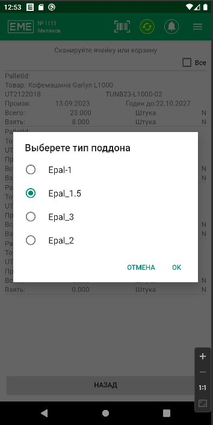

# Class to show Dialog Fragment with radio buttons

## Usage:

1. Import class
2. Create object ```RadioButtonsDialogFragment``` with args ```title : String``` and ```radioValues : Array<String>```
3. Call ```setOnClick``` where override ```onOkClickListener``` and ```onCancelClickListener```
4. Call ```show```

## Example:

```java
RadioButtonsDialogFragment RadioButtonsDialogFragment = new RadioButtonsDialogFragment(
                            "Выберете тип поддона", array);
RadioButtonsDialogFragment.setOnClick(new EMERadioButtonsDialog.OnButtonClick() {
    @Override
    public void onOkClickListener(@NonNull String result) {
        Log.d("RadioButtonsDialogFragment ok: ",result);
    }
    @Override
    public void onCancelClickListener() {

    }
});
RadioButtonsDialogFragment.show(getSupportFragmentManager(), "RadioButtonsDialogFragment");
```

## Screenshot

